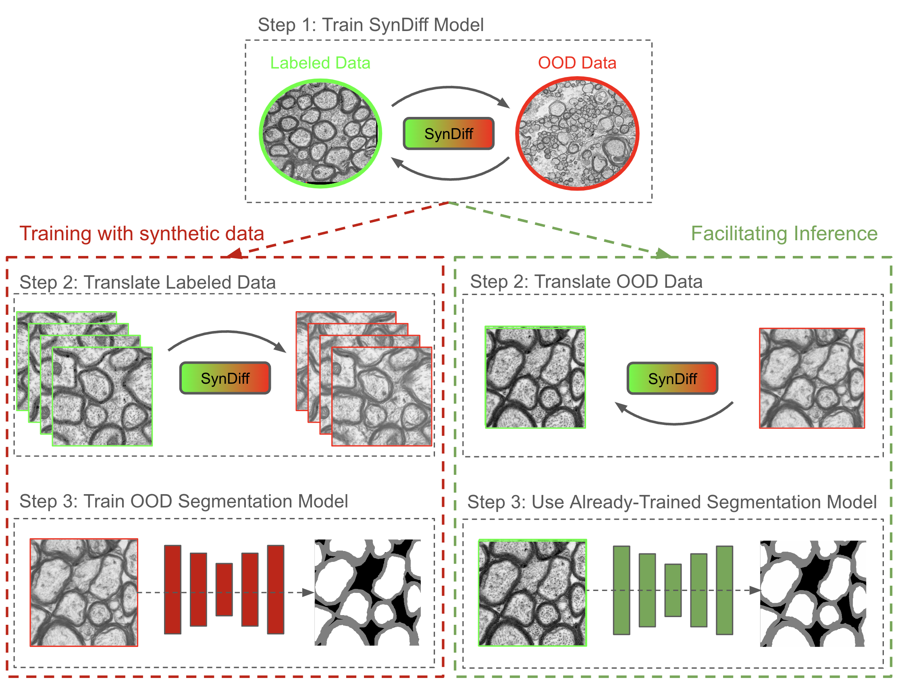

# AxonDeepSynth

This repository provides a framework that leverages unsupervised image translation to facilitate the use of segmentation models under out-of-distribution (OOD) scenarios. The process is outlined in two primary pipelines:

1. **Synthetic OOD Data Generation for Training:**
   - **Step 1:** Train the SynDiff model for unsupervised image translation between an existing labeled dataset and the target OOD modality.
   - **Step 2:** Use the trained SynDiff model to translate the labeled dataset into the OOD modality, creating a synthetic OOD dataset.
   - **Step 3:** Train a nnunet segmentation model on this synthetic OOD dataset to perform axon segmentation when no ground truth data is available for the desired modality.

2. **Translation for Inference Compatibility:**
   - Alternatively, the SynDiff model can translate OOD data into a modality for which a segmentation model is already trained. This allows the use of existing, well-performing models on data that were originally incompatible due to differences in imaging modalities.



Both pipelines enhance the versatility of medical image segmentation models by enabling them to operate effectively across different imaging modalities without the need for extensive labeled data in each specific modality.

## SynDiff

This repository employs the SynDiff model for unsupervised image translation, as elaborated in the [paper](https://arxiv.org/abs/2207.08208) titled "Unsupervised Medical Image Translation with Adversarial Diffusion Models".

## Architecture and Training

The SynDiff architecture and training process are designed to address the challenges of unsupervised medical image translation. Here's a brief overview of how it works:

1. **Adversarial Diffusion Process**: The model utilizes a fast diffusion process combined with a conditional adversarial approach. This innovative method models complex transition probabilities in reverse diffusion, enabling efficient and high-quality image generation.

2. **Network Architecture**: SynDiff employs a cycle-consistent architecture that integrates both diffusive and non-diffusive modules. This dual-module system is crucial for learning from unpaired images, facilitating effective bilateral translation between two distinct imaging modalities.

3. **Learning Procedures**: The training leverages unsupervised learning strategies, primarily through a cycle-consistency loss. This involves comparing the true target images against their reconstructions from both the diffusive and non-diffusive modules. Additionally, the model is optimized using adversarial losses, which helps in refining the translation process and improving the model's performance.

This structured approach ensures that SynDiff can generate medically accurate and visually coherent translations, making it a robust tool for enhancing the adaptability of medical image segmentation models across various imaging modalities.

### How to Cite SynDiff
If you utilize this model or the associated code, please cite their paper as follows:

```
@misc{özbey2023unsupervised,
      title={Unsupervised Medical Image Translation with Adversarial Diffusion Models}, 
      author={Muzaffer Özbey and Onat Dalmaz and Salman UH Dar and Hasan A Bedel and Şaban Özturk and Alper Güngör and Tolga Çukur},
      year={2023},
      eprint={2207.08208},
      archivePrefix={arXiv},
      primaryClass={eess.IV}
}

```


## Installation
- Clone this repo:
```bash
git clone git@github.com:axondeepseg/AxonDeepSynth.git
cd AxonDeepSynth
```

### Setting Up Conda Environment

To set up the environment and run the scripts, follow these steps:

1. Create a new conda environment:
```bash
conda create --name axondeepsynth
```
2. Activate the environment:
```bash
conda activate axondeepsynth
```
3. Install PyTorch, torchvision, and torchaudio. For NeuroPoly lab members using the GPU servers, use the following command:
```bash
conda install pytorch torchvision torchaudio pytorch-cuda=12.1 -c pytorch -c nvidia
```
For others, please refer to the PyTorch installation guide at https://pytorch.org/get-started/locally/ to get the appropriate command for your system.

4. Update the environment with the remaining dependencies:
```bash
conda env update --file environment.yaml
```

## Usage

### Syndiff Dataset

Regardless of the pipeline you choose you need to first train a SynDiff model between two datasets conataining 2 different modalities. These can be real modalities such as SEM and TEM or pseudo-modalities such as out-of-distribution (OOD) datasets which were captured under different imaging conditions despite having the same official imaging modality (2 TEM datasets can look different depending on the species and equipment used). First we need to create a dataset that can be used for training the SynDiff model. This is done via the `create_syndiff_dataset.py` script via the following command:

```bash
python scripts/create_syndiff_dataset.py --modality1 <MODALITY1> \
                                         --modality2 <MODALITY2> \
                                         --modality1_paths <PATH/TO/MODALITY1/DATASET1> <PATH/TO/MODALITY1/DATASET2> ... \
                                         --modality2_paths <PATH/TO/MODALITY2/DATASET1> <PATH/TO/MODALITY2/DATASET2> ... \
                                         --output_path <PATH/TO/SAVE/DATASET> \
                                         --modality1_scale_factors <SCALE_FACTOR_MODALITY1_DATASET1> <SCALE_FACTOR_MODALITY1_DATASET2> ... \
                                         --modality2_scale_factors <SCALE_FACTOR_MODALITY2_DATASET1> <SCALE_FACTOR_MODALITY2_DATASET2> ... \
```

In the previous command, `SCALE_FACTOR_MODALITY1_DATASET1`, `SCALE_FACTOR_MODALITY1_DATASET2`, `SCALE_FACTOR_MODALITY2_DATASET1`, and `SCALE_FACTOR_MODALITY2_DATASET2` are the scale factors for the corresponding datasets. These scale factors are crucial for ensuring that similar structures across the two modalities are comparable in size. Additionally, the script supports parameters to exclude subdirectories that might contain irrelevant .png files. By default, it assumes a BIDS format or the `imagesTr` format from nnUNet for input directories.

The result of the above script is a dataset that can be used for training the SynDiff model. The dataset is structured as follows:

```
input_path/
  ├── dataset_train.hdf5
  ├── dataset_val.hdf5
  ├── dataset_test.hdf5

```

where each .hdf5 file is a dataset with the following structure: At the top level, the HDF5 file contains keys corresponding to two distinct data modalities. Each modality key then contains datasets indexed by sequential integers as strings ('0', '1', '2', ..., `<length modality>`), representing individual samples.

### Training SynDiff Translation Model

Once the dataset is ready, proceed to train the SynDiff model. Execute the `train.py` script with the following command, which overrides the default parameters specified in the `configs/syndiff.yaml` file.

```bash
python train.py exp=<EXPERIMENT_NAME> \
                contrast1=<MODALITY1> \
                contrast2=<MODALITY2> \
                network_distribution.gpus=[<GPU_ID_1>, <GPU_ID_2>, ..., <GPU_ID_k>] \
                training_config.training_dataset_path=<PATH_TO_DATASET> \
                syndiff_results_path=<PATH_TO_SAVE_RESULTS> \
                model_config.image_size=<IMAGE_SIZE> \ # Image size to use for training.
```

### Tutorship: Training a Segmentation Model with Synthetic Data

This section assumes that you have successfully trained the SynDiff model. Additionally, ensure that the <NNUNET_DIR> directory is created beforehand as it will serve as the designated directory for the nnUNet pipeline operations. Once the SynDiff model is trained, you are ready to translate datasets from one modality to another. Begin by generating the dataset for translation using the `scripts/create_dataset_to_be_translated.py` script with the command below:

```bash
python scripts/create_dataset_to_be_translated.py <PATH_TO_DATASET_TO_TRANSLATE> \ # Path to the nnUNet dataset to translate.
                                                  <OUTPUT_PATH> \ # Path to save the dataset. The name of the file will be <SOURCE_CONTRAST>/<FILENAME>_<SOURCE_CONTRAST>.hdf5"
                                                  --filename <FILENAME> \ # Name of the file to save the dataset.
                                                  --scale_factor <SCALE_FACTOR> \ # Scale factor used to resize the images in the dataset before translation.
                                                  --tile-size <TILE_SIZE> \ # Must be the same as the one used during training.
                                                  --modality <SOURCE_CONTRAST> \ # Modality to translate from.
                                                  --is-nnunet-dir # Indicates that the source dataset is for nnUNet training
```

Next, use the `translate_dataset.py` script to translate the resulting dataset with the following command:

```bash
python scripts/translate_dataset.py    exp=<EXPERIMENT_NAME> \
                                       contrast1=<MODALITY1> \
                                       contrast2=<MODALITY2> \
                                       translation_config.path_dataset_to_translate=<PATH_TO_DATASET> \ # Path to the dataset to translate. This should be the output path of the create_dataset_to_be_translated.py script
                                       network_distribution.gpus=[<GPU_ID_1>, <GPU_ID_2>, ..., <GPU_ID_k>] \
                                       translation_config.which_epoch=<EPOCH> \ # Epoch to use for translation
                                       translation_config.source_contrast=<SOURCE_CONTRAST> \ # Modality to translate from
                                       segmentation_config.nnunet_dataset_id=<NNUNET_DATASET_ID> \ # Nnunet dataset id of the output dataset.
                                       segmentation_config.nnunet_dir=<NNUNET_DIR> \ # Nnunet directory of the output dataset.
                                       translation_config.is_nnunet_dir=True\ # Indicates that we are translating an nnunet dataset and not just a folder containing images.
                                       syndiff_results_path=<PATH_TO_SAVE_RESULTS> \ # Path to syndiff results where the checkpoint of the model is saved. Is the same as the one used during training.
```

This process will generate a new nnUNet dataset, enabling the commencement of training for the specialized OOD nnUNet model:
```bash
source ./scripts/setup_nnunet.sh <NNUNET_DIR> <NNUNET_DATASET_ID>

./scripts/train_nnunet.sh <NNUNET_DATASET_ID> <DATASET_NAME> <GPU_ID> <FOLD_1> <FOLD_2> ... <FOLD_k>
```
To parallelize the execution of the training script for faster processing, you can run multiple instances of the script simultaneously, each handling a different fold for cross-validation. This is particularly useful when you have access to a machine with multiple GPUs. Here's an example command that demonstrates how to run training on 5 folds in parallel:

```bash
./scripts/train_nnunet.sh <NNUNET_DATASET_ID> <DATASET_NAME> <GPU_ID> 0 &
./scripts/train_nnunet.sh <NNUNET_DATASET_ID> <DATASET_NAME> <GPU_ID> 1 & 
./scripts/train_nnunet.sh <NNUNET_DATASET_ID> <DATASET_NAME> <GPU_ID> 2 & 
./scripts/train_nnunet.sh <NNUNET_DATASET_ID> <DATASET_NAME> <GPU_ID> 3 & 
./scripts/train_nnunet.sh <NNUNET_DATASET_ID> <DATASET_NAME> <GPU_ID> 4 & 
```

### Adaptation: Translating OOD Images to a Modality Compatible with a Trained Segmentation Model

This section assumes that you have successfully trained the SynDiff model. Once the SynDiff model is trained, you are ready to translate datasets from one modality to another. Begin by generating the dataset for translation using the `scripts/create_dataset_to_be_translated.py` script with the command below:

```bash
python scripts/create_dataset_to_be_translated.py <PATH_TO_DATASET_TO_TRANSLATE> \ # Path to the dataset to translate.
                                                  <OUTPUT_PATH> \ # Path to save the dataset. The name of the file will be <SOURCE_CONTRAST>/<FILENAME>_<SOURCE_CONTRAST>.hdf5"
                                                  --filename <FILENAME> \ # Name of the file to save the dataset.
                                                  --scale_factor <SCALE_FACTOR> \ # Scale factor used to resize the images in the dataset before translation.
                                                  --tile-size <TILE_SIZE> \ # Must be the same as the one used during training.
                                                  --modality <SOURCE_CONTRAST> \ # Modality to translate from.
```

Next, use the `translate_dataset.py` script to translate the resulting dataset with the following command:

```bash
python scripts/translate_dataset.py    exp=<EXPERIMENT_NAME> \
                                       contrast1=<MODALITY1> \
                                       contrast2=<MODALITY2> \
                                       translation_config.path_dataset_to_translate=<PATH_TO_DATASET> \ # Path to the dataset to translate. This should be the output path of the create_dataset_to_be_translated.py script
                                       network_distribution.gpus=[<GPU_ID_1>, <GPU_ID_2>, ..., <GPU_ID_k>] \
                                       translation_config.which_epoch=<EPOCH> \ # Epoch to use for translation
                                       translation_config.source_contrast=<SOURCE_CONTRAST> \ # Modality to translate from
                                       translation_config.output_dir=<OUTPUT_DIR> \ # Path to save the translated dataset.
                                       translation_config.is_nnunet_dir=False\ # Indicates that we are translating an nnunet dataset and not just a folder containing images.
                                       syndiff_results_path=<PATH_TO_SAVE_RESULTS> \ # Path to syndiff results where the checkpoint of the model is saved. Is the same as the one used during training.
```


### Inference with a Trained Segmentation Model

After you have a trained nnunet and have run the `source ./scripts/setup_nnunet.sh` command, you run inference via the following command:
```bash
python scripts/run_inference.py --path-dataset ${nnUNet_raw}/Dataset<FORMATTED_DATASET_ID>_<DATASET_NAME>/imagesTs --path-out <WHERE/TO/SAVE/RESULTS> --path-model ${nnUNet_results}/Dataset<FORMATTED_DATASET_ID>_<DATASET_NAME>/nnUNetTrainer__nnUNetPlans__2d/ --use-gpu --use-best-checkpoint
```
The `--use-best-checkpoint` flag is optional. If used, the model will use the best checkpoints for inference. If not used, the model will use the latest checkpoints. Based on empirical results, using the `--use-best-checkpoint` flag is recommended.

Note: `<FORMATTED_DATASET_ID>` should be a three-digit number where 1 would become 001 and 23 would become 023.

# Acknowledgements

This code uses libraries from, [pGAN](https://github.com/icon-lab/pGAN-cGAN), [StyleGAN-2](https://github.com/NVlabs/stylegan2), and [DD-GAN](https://github.com/NVlabs/denoising-diffusion-gan) repositories.
